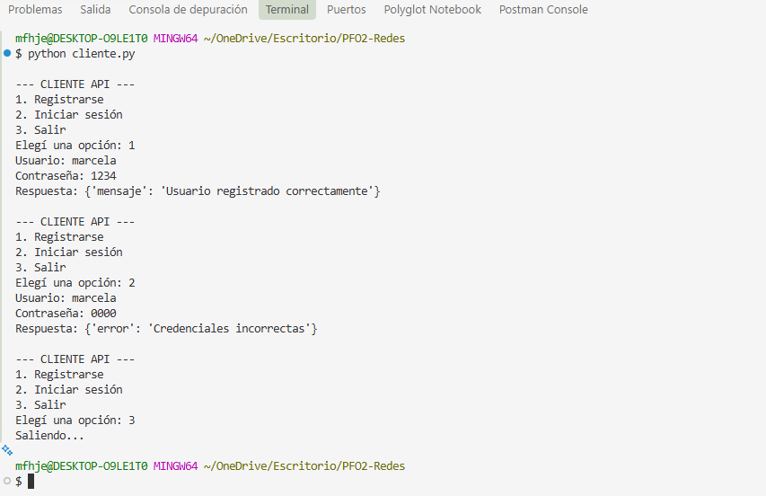
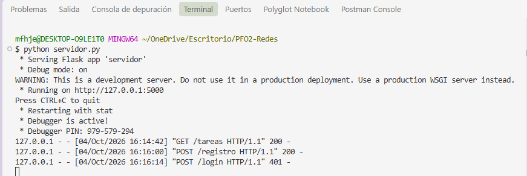
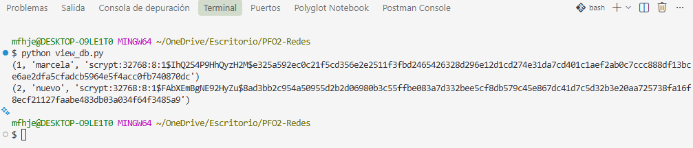

# PFO 2 - Sistema de Gestión de Tareas

## Descripción
API REST desarrollada con Flask que permite registrar usuarios, iniciar sesión y gestionar acceso a una vista de tareas.
Incluye autenticación con contraseñas hasheadasy ersistencia en SQLite.

---

## Requisitos e Instalación
* Python 3
* Flask
* Werkzeug
* Requests

---
##  Instalación
Para instalar todas las librerías necesarias, ejecutá en la terminal:

```bash
pip install flask werkzeug requests

```
---

## Estructura del Proyecto

```text
PFO2-Redes/
├── capturas/
│   ├── 1_registro.png          # Captura del flujo en cliente CLI
│   ├── servidorc_onsola.png    # Captura de peticiones HTTP en consola Flask
│   ├── db.png                  # Captura de registros y hashes en SQLite
│   └── iniciohtml.png         # Captura de interfaz web en navegador
         
├── index.html                  # Cliente web
├── servidor.py                 # API REST con Flask y SQLite
├── cliente.py                  # Cliente de terminal interactivo
├── view_db.py                  # Script para consultar la base de datos
├── database.db                 # Base de datos SQLite
└── README.md                   # Documentación del proyecto
```
---

## Cómo Ejecutar el Proyecto

1. Iniciar el servidor Flask:
```
python servidor.py

```
2. Probar la Interfaz Web:
Ingresar desde el navegador a: http://127.0.0.1:5000/tareas

3. Probar el Cliente de Consola:
En otra terminal, ejecutar: 

``` 
python cliente.py
```

---

## Endpoints de la API
* POST /registro : Registra un usuario y almacena la contraseña hasheada.
* POST /login : Valida las credenciales comparando hashes seguros.
* GET /tareas : Muestra la pantalla web con el formulario y mensaje de bienvenida.
* GET / : Redirige automáticamente a /tareas.

---

## Base de Datos
* Motor: SQLite (archivo database.db)
* Tabla: usuarios (columnas: id, usuario, contraseña hasheada)

---

## Respuestas Conceptuales

¿Por qué hashear contraseñas?
* No se almacenan en texto plano.
* Protege al usuario si le sustraen la base de datos.
* Es una práctica estándar de seguridad.
* Evita accesos no autorizados.

Ventajas de SQLite:
* No requiere intalación de servidor.
* Fácil de utilizar.
* Portabletoda la base de datos de guarda (en un único archivo.db).
* Integración directa con python.

---

## Capturas del funcionamiento

### 1. Cliente (Registro y Login)


### 2. Consola del Servidor Flask


### 3. Base de Datos SQLite (Hashes)


### 4. Interfaz Web (/tareas)

